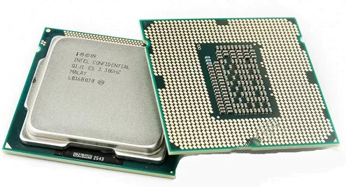
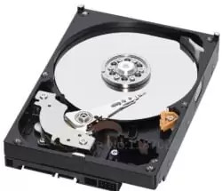

//M'han recomanat que utilitze la lletra Verdana per a persones amb dificultats visuals

<!-- _paginate: false -->
# Hardware
Curs de preparació de les proves d'accés de CFGS :smile:

---
## La placa base
La Placa base es el dispositivo con la funcionalidad del circuito para el resto de componentes del ordenador, CPU, RAM, Discos, Tarjeta gráfica, disipadores. Hoy en día, la mayoría de placas base tienen las tarjetas gráficas, de audio y de red. Aunque las Tarjetas gráficas integradas se quedaran un poco cortas para usar programas audiovisuales que requieran más rendimiento. Por último hay que tener en cuenta, que si montamos un ordenador, Entre el Procesador y la placa base debe coincidir el socket.

---
## Procesador (CPU, Central Processing Unit)

Como su nombre indica, es el encargado de ejecutar las ordenes en memoria, ejecutando el sistema operativo, aplicaciones y administrando los diferentes dispositivos del ordenador.

!!!warning "Compte!"
    Cada procesador es compatible con un socket. Es necesario que el socket de la placa base coincida con el del procesador

??? note "Ejemplos de socket AMD"
    Socket AM4
    Socket AM5

???+ example "Ejemplos de socket Intel"
    Socket 1200
    Socket 1700

---

## Memoria RAM (Random Access Memory)

En la RAM son almacenadas todas las instrucciones con las que está trabajando el procesador (Sistema operativos y aplicaciones). A mayor memoria, más facilidades tendrá el equipo para mover más aplicaciones y de mayor potencia.

---

## Video la memoria RAM

<iframe width="720" height="480" src="https://www.youtube.com/embed/yRNwl24l39E?si=XG6UzYTWclC5E9rV" title="YouTube video player" frameborder="0" allow="accelerometer; autoplay; clipboard-write; encrypted-media; gyroscope; picture-in-picture; web-share" referrerpolicy="strict-origin-when-cross-origin" allowfullscreen></iframe>

---

## La tarjeta gráfica
La tarjeta gráfica es la encargada, junto a un monitor, de enseñarnos la información que esta procesando el ordenador, como hemos comentado anteriormente, algunas placas base, llevan una tarjeta básica incluida, pero para un mayor rendimiento necesitaremos una tarjeta especializada.

---

## Fuente de alimentación

La fuente de alimentación se encarga de convertir la corriente alterna en corriente continua. A mayor potencia tenga nuestro ordenador, mayor será la cantidad de vatios que consumiremos, y por tanto, necesitaremos una fuente de alimentación más potente.

!!!danger "Peligro!!"
    No se debe abrir la fuente de alimentación.

---

## Almacenamiento secundario

Son nuestros dispositivo para almacenar nuestra información, principalmente hay 2 tecnologias de almacenamiento

* **SSD**: Son los más rápidos, pero su esperanza de vida es más corta, se suelen utilizar para instalar el sistema operativo o para ordenadores que no han de mover grandes cantidades de datos.

* **Disco duro**: Los discos más comunes, son los más baratos pudiendo almacenar gran cantidad de información a un precio reducido.

---

## Chasis

En el chasis o la caja, pondremos todos nuestros componentes, a mayor tamaño y precio tenga la caja, más slots para periféricos y disipadores tendrá, dándole mayor rendimiento y funcionalidad al ordenador. Por norma general, Si no es un ordenador que necesite mucha potencia, el chasis no seré un factor prioritario.

---

## Disipadores

Los disipadores nos ayudarán a mantener la temperatura del ordenador para que no se calienten demasiado, hay varios tipos, los más usados son:

* **Pasiva**: Con algún material conductor, en forma de aspas sobresalientes separadas por espacios huecos, la conducción y la forma de estas ayuda a desplazar el calor hacia las puntas de las aspas. Se colocan cerca de los puntos de más calor, como los procesadores, acompañados de otro disipador de aire para aumentar su eficacia.

---

* **Aire**: estos son los disipadores más reconocibles, pequeños ventiladores que colocaremos en sitios específicos del chasis para mejorar la ventilación del ordenador.

* **Líquida**: Como su nombre indica, en la refrigeración líquida usaremos un circuito cerrado con agua para enfriar el sistema,  son ligeramente más eficaces que los disipadores de aire y completamente silenciosos. Por el contrario requieren más mantenimiento, ya que hay que rellenar y limpiar el circuito con regularidad. [Pulsa aquí para más información](https://www.xataka.com/componentes/refrigeracion-liquida-que-como-funciona-cuando-merece-pena-apostar-ella-para-propulsar-nuestro-pc)

---

## El gall Claudio

Per despertar-nos aquestes pasques us deixe un audio del gall Claudio

<audio controls>
  <source src="audio/gall.mp3" type="audio/mpeg">
Your browser does not support the audio element.
</audio>

---

## Felicitació pasqua

<video width="600" height="400" controls>
  <source src="video/video.mp4">
El teu navegador no soporta l'etiqueta video. Actualitza'l.
</video>

